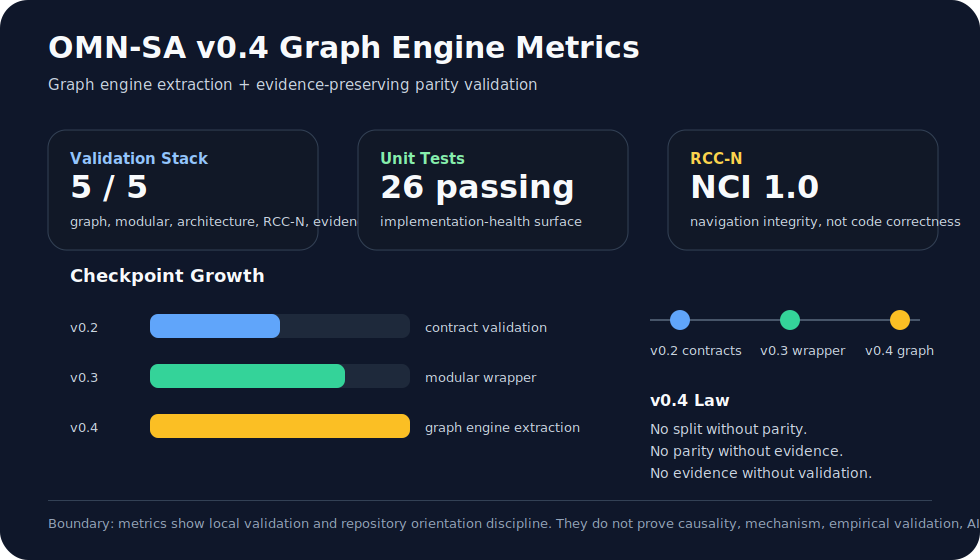
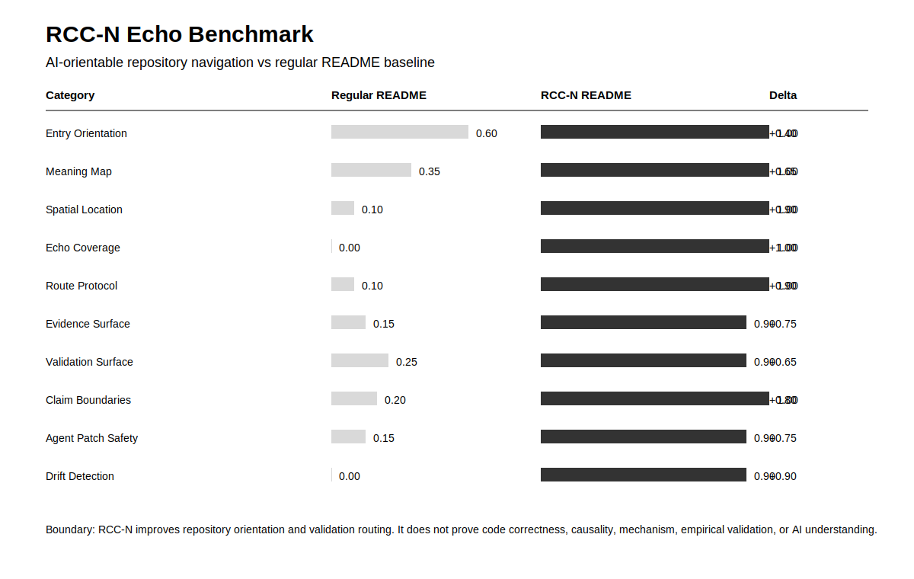
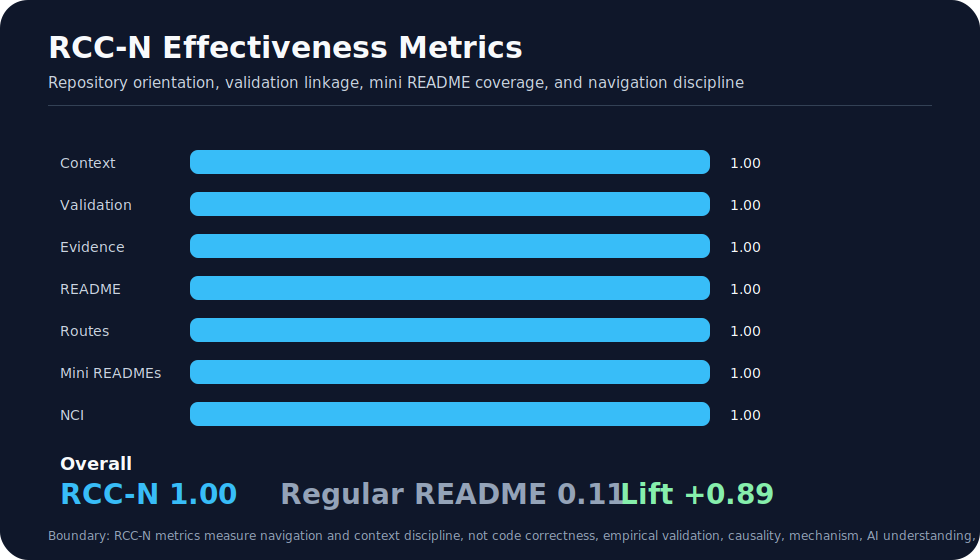

# Observable Manifold Network: Governed Observable-Topology Runtime

## Repository Description

Governed observable-topology runtime with source-bounded GMN attribution, typed graph contracts, residual validation, baseline comparison, topology sensitivity, claim gates, evidence packages, and RCC-N repository navigation.

This repo combines three layers:

1. OMN runtime: observable nodes, interaction matrix construction, typed graph contracts, simple node-local generators, generated-state rollout, residual validation, baseline comparison, topology sensitivity, residual attribution, and evidence packages.
2. RCC-N navigation: Human Director Box, README trisection, repository sphere, route maps, Echo Location records, Nexus context index, and validation-bound AI operating protocol.
3. Codex documentation shell: software architecture, source boundary, injection records, validation surfaces, non-claim locks, and folder-level mini READMEs.

Boundary: this description improves discoverability and maintenance discipline. It does not prove code correctness, security, patch safety, AI understanding, benchmark validity, empirical validation, production readiness, causality, mechanism, biological equivalence, physical manifold identity, or full GMN replication.

> Observable Manifold Network is a local-first reference runtime for testing whether an observable-topology scaffold can declare observable nodes, type interaction edges, construct graph contracts, generate future states, validate residuals, compare baselines, report topology sensitivity, preserve non-claim locks, and emit audit-ready evidence packages.

Important boundary: this is not a claim to have invented Generative Manifold Networks. GMN remains Park et al.'s method. OMN is a Codex software/runtime architecture and documentation shell.

## Human Director Box

### What is this?

Observable Manifold Network is a governed software workbench for observable-topology dynamical modeling. It tests whether a local runtime can map data columns or declared artifacts into observable nodes, infer or load interaction matrices, build typed graph contracts, generate state trajectories, compare generated state against validation surfaces, preserve residuals, and emit evidence packages.

### What changed?

This update adds the AERMA-style README trisection and RCC-N navigation shell:

- PART I - Human README
- PART II - RCC Nexus README
- PART III - AI Agent README

It also adds folder-level mini READMEs with RCC Nexus Echo Location blocks, a docs/context shell, rcc/nexus route maps, and software-architecture/injection documents.

### Current health snapshot

| Surface | Current result |
|---|---:|
| Package / CLI | omn |
| Runtime status | minimal local scaffold |
| Seeds | synthetic-toy, lorenz, artifact-graph |
| Evidence emission | state, evidence, report, plots, logs, ledger |
| Current tests | 26 passing |
| Claim status | runtime-validated locally |
| Source boundary | GMN authorship preserved |
| RCC-N mode | self-reported repository navigation shell |
| NCI mode | self |
| NCI self | 1.0 |

### What this is not

- Not a claim to have invented GMN.
- Not a full GMN replication.
- Not empirical validation.
- Not proof of causality.
- Not proof of mechanism.
- Not biological equivalence.
- Not physical manifold identity.
- Not proof that observable topology is truth.
- Not proof that a toy Lorenz run validates the source paper.
- Not proof that RCC-N navigation proves code correctness or patch safety.

### Where do I start?

1. Read this README.
2. Open `docs/context/repository_context_index.json`.
3. Open `docs/context/rcc_nexus_index.json`.
4. Open `rcc/nexus/route_map.json`.
5. Run `python scripts/rcc/check_rcc_nexus.py`.
6. Run `python -m unittest discover -s tests`.
7. Run `python -m omn run --seed synthetic-toy`.
8. Review `outputs/evidence/`.

---

# PART I - Human README

## Current Identity

Observable Manifold Network is a local Python reference runtime for testing whether an observable-topology system can:

- declare observable nodes,
- compute interaction matrices,
- build typed graph contracts,
- preserve graph non-claim boundaries,
- run node-local generators,
- produce generated future states,
- validate residuals,
- compare against baselines,
- report topology sensitivity,
- attribute residuals by node,
- gate claims,
- emit evidence packages and ledgers,
- expose repository context through RCC mini READMEs,
- expose geometric repository navigation through RCC-N.

The current repo is a minimal scaffold, not a production scientific modeling platform.

## Quick Start

Set the local package path:

    $env:PYTHONPATH = "$PWD\src"

Run CLI help:

    python -m omn --help

Run seed examples:

    python -m omn run --seed synthetic-toy
    python -m omn run --seed lorenz
    python -m omn run --seed artifact-graph

Validate latest evidence:

    python -m omn validate

Run tests:

    python -m unittest discover -s tests

Run RCC-N checker:

    python scripts/rcc/check_rcc_nexus.py

## What OMN Tests

| Task | Purpose |
|---|---|
| `synthetic-toy` | Tests minimal observable-node graph construction and evidence emission. |
| `lorenz` | Tests low-dimensional dynamical demonstration using a Lorenz-style seed. |
| `artifact-graph` | Tests Codex-style artifact graph behavior using observable repository surfaces. |

OMN rewards bounded evidence emission, not confident overclaiming.

## Current Hardening Layer

The current hardening layer includes:

- source-bound GMN attribution,
- observable-node declaration,
- typed edge records,
- graph contract emission,
- residual validation,
- baseline comparison,
- topology sensitivity report,
- residual attribution,
- claim gate,
- state/evidence/report/log/ledger outputs,
- RCC-N README trisection,
- mini README Echo Location records,
- AI route protocol.

## Project Structure

    observable-manifold-network/
      AGENTS.md                         # Agent entry beacon and operating contract
      README.md                         # Human / RCC Nexus / AI trisection
      README_90_SECONDS.md              # Short adoption compression
      .github/workflows/ci.yml          # GitHub Actions validation surface
      configs/                          # Runtime and seed configuration
      docs/
        architecture/                   # Source boundary and architecture notes
        architecture_changes/           # Versioned architecture-change records
        benchmarks/                     # RCC-N benchmark reports and metrics
        context/                        # RCC indexes, validation surfaces, drift reports
        future_architecture/            # Planned architecture tracks
        injected_theory/                # Source-bounded theory admitted by process
        injections/                     # Governance/module/documentation injections
        protocols/                      # AI and non-claim protocols
        public_release/                 # Public-safe RCC-N explanations
        release_notes/                  # Version continuity records
        software_architecture/          # OMN-SA software architecture documents
        theory/                         # GMN and OMN theory summaries
      examples/                         # Seed entry points
      outputs/
        state/                          # Runtime state artifacts
        evidence/                       # Evidence packages
        reports/                        # Runtime reports
        plots/                          # Diagnostic plots
        logs/                           # Runtime logs
        ledger/                         # JSONL continuity records
      rcc/nexus/                        # RCC-N route maps, protocol, Echo template, handoff
      reports/
        architecture/                   # OMN-SA architecture validation reports
        rcc_nexus/                      # RCC-N checker reports
      schemas/
        omn/                            # OMN schema contracts
        rcc_nexus/                      # RCC-N schema contracts
      scripts/
        rcc/                            # RCC-N checker scripts
        release/                        # Fresh-clone verification
        validation/                     # Architecture contract validator
        run_all_checks.ps1              # Local validation bundle
      src/omn/
        core/                           # Runtime implementation
        schemas/                        # Runtime schema surfaces
      tests/                            # unittest implementation-health validation
      visuals/rcc_nexus/                # RCC-N charts
## Project Structure Director

| Surface | What it does | Why it matters |
|---|---|---|
| `AGENTS.md` | Gives coding agents the entry order, route rules, and validation requirements. | Prevents blind patching. |
| `README.md` | Provides Human, RCC Nexus, and AI Agent layers. | Makes repo readable by humans and AI agents. |
| `README_90_SECONDS.md` | Provides adoption compression. | Reduces onboarding friction. |
| `configs/` | Stores runtime and seed configuration. | Makes runtime assumptions inspectable. |
| `docs/context/` | Stores repository context index, Nexus index, validation surface, and drift reports. | Main repository self-description surface. |
| `docs/software_architecture/` | Stores OMN-SA software architecture shell. | Keeps theory-to-software direction explicit. |
| `docs/injections/` | Stores RCC/RCC-N injection records. | Records governance additions as explicit injections. |
| `rcc/nexus/` | Stores RCC-N protocol, route maps, task matrix, Echo template, and handoff contract. | Makes the repo agent-navigable. |
| `scripts/rcc/` | Stores RCC-N checker and future repair scripts. | Enforces repository-context integrity. |
| `src/omn/core/` | Stores the executable runtime implementation. | Contains current OMN runtime and extracted graph-engine modules. |
| `src/omn/schemas/` | Stores state and evidence schemas. | Supports evidence package validation. |
| `examples/` | Stores seed execution examples. | Gives humans a simple entry path. |
| `tests/` | Stores implementation-health tests. | Catches local scaffold regressions. |
| `outputs/` | Stores generated run artifacts. | Preserves state, evidence, reports, plots, logs, and ledgers. |
| `reports/rcc_nexus/` | Stores RCC-N checker reports. | Makes navigation health inspectable. |
| `visuals/rcc_nexus/` | RCC-N chart and benchmark visualization surface. | Will support NCI and coverage visualization. |

## Structure Reading Route

For humans:

1. Read the Human Director Box.
2. Read Project Structure Director.
3. Open `docs/context/rcc_nexus_index.json`.
4. Run `python -m unittest discover -s tests`.
5. Run `python -m omn run --seed synthetic-toy`.

For AI agents:

1. Read `AGENTS.md`.
2. Read this README.
3. Read `docs/context/repository_context_index.json`.
4. Read `docs/context/rcc_nexus_index.json`.
5. Read `rcc/nexus/route_map.json`.
6. Read the target folder README.
7. Inspect source/tests/evidence before patching.
8. Run declared validation.

Structure boundary: project structure improves navigation. It does not prove correctness, security, patch safety, AI understanding, benchmark validity, production readiness, causality, mechanism, or source-paper replication.

## Evidence Artifacts

Runtime state artifacts are written under:

    outputs/state/

Evidence packages are written under:

    outputs/evidence/

Reports are written under:

    outputs/reports/

Plots are written under:

    outputs/plots/

Runtime logs are written under:

    outputs/logs/

Ledgers are written under:

    outputs/ledger/

RCC-N reports are written under:

    docs/context/drift/
    reports/rcc_nexus/

## Non-Claim Locks

Observable Manifold Network is:

- not GMN,
- not a full replication of Park et al.,
- not empirical validation,
- not proof of causality,
- not proof of mechanism,
- not biological equivalence,
- not physical manifold identity,
- not proof that observable topology equals truth,
- not proof that prediction equals mechanism,
- not proof that simulation equals validation,
- not proof that RCC-N navigation validates code correctness.

---

# PART II - RCC Nexus README

## RCC Nexus Identity

Observable Manifold Network includes a local RCC Nexus layer based on RCC-N v1.0.

RCC tells the agent what the repository means.

RCC-N tells the agent where it is.

Validation tells the agent whether reality agreed.

## Repository Sphere

| Shell | Name | Meaning |
|---|---|---|
| `center` | Invariant Core | Purpose, source boundary, non-claim locks, evidence boundaries, safety rules. |
| `inner` | Primitives | Source modules, schemas, runtime objects, graph contracts, state/evidence schemas. |
| `middle` | Processes | CLI flow, examples, tests, scripts, checker workflows, validation commands. |
| `outer` | Evidence / Reflection | Outputs, ledgers, reports, visuals, public summaries, drift reports. |

## Nexus Meridians

- source
- validation
- evidence
- drift
- agent
- safety
- runtime
- graph
- release
- documentation

## Nexus Sectors

- core
- schemas
- graph
- runtime
- validation
- evidence
- rcc
- agent
- examples
- release

## Primary Nexus Files

- `docs/context/repository_context_index.json`
- `docs/context/rcc_nexus_index.json`
- `docs/context/validation_surface.md`
- `rcc/nexus/README.md`
- `rcc/nexus/rcc_nexus_protocol.md`
- `rcc/nexus/route_map.json`
- `rcc/nexus/task_routing_matrix.md`
- `rcc/nexus/echo_location_template.md`
- `rcc/nexus/agent_handoff_contract.md`
- `scripts/rcc/check_rcc_nexus.py`
- `reports/rcc_nexus/latest_rcc_nexus_check.md`

## Nexus Context Integrity

Current NCI mode: `self`.

Current NCI target: `0.90+`.

NCI components:

- completeness,
- link correctness,
- pattern rigidity,
- invariant compliance,
- evidence / validation linkage,
- drift freshness,
- coordinate completeness.

NCI is not code quality proof.

## RCC Nexus Echo Location

Sphere Position:

- Shell: center
- Meridian(s): source, safety, agent, runtime, evidence
- Sector: rcc
- Version / TTL: RCC-N-v1.0 / 180 days
- Last Verified: 2026-05-16

Local Role:

- Root orientation surface for humans, RCC Nexus navigation, and AI agents.

Inbound Hooks:

- GitHub repository page
- local PowerShell build scripts
- OMN-SA software architecture

Outbound Hooks:

- docs/context/repository_context_index.json
- docs/context/rcc_nexus_index.json
- docs/context/validation_surface.md
- rcc/nexus/route_map.json
- src/omn/core/runtime.py
- tests/test_runtime.py
- outputs/evidence/

Evidence Surface:

- outputs/evidence/
- outputs/state/
- outputs/reports/
- reports/rcc_nexus/latest_rcc_nexus_check.md

Validation Surface:

- python -m unittest discover -s tests
- python -m omn --help
- python -m omn run --seed synthetic-toy
- python -m omn run --seed lorenz
- python -m omn run --seed artifact-graph
- python scripts/rcc/check_rcc_nexus.py

Claim Boundary:

- README quality, RCC-N geometry, reports, charts, and NCI do not prove code correctness, security, patch safety, AI understanding, benchmark validity, empirical validation, production readiness, causality, mechanism, or GMN replication.

Non-Claim Locks:

- geometry_is_not_ai_internal_proof
- nci_is_not_code_quality_proof
- navigation_is_not_validation
- context_reconstruction_is_not_correctness_proof
- validation_remains_required
- observable_topology_is_not_truth
- prediction_is_not_mechanism
- simulation_is_not_proof

Agent Route:

- Read README.md, docs/context/repository_context_index.json, docs/context/rcc_nexus_index.json, rcc/nexus/route_map.json, then the target folder README before editing.

Update Obligation:

- Update README, RCC context, Nexus index, route maps, reports, charts, and Echo Location records when project identity, validation commands, evidence paths, claim boundaries, or repository geometry changes.

## RCC Nexus Reports

| Artifact | Purpose |
|---|---|
| `reports/rcc_nexus/latest_rcc_nexus_check.json` | Machine-readable RCC-N checker snapshot. |
| `reports/rcc_nexus/latest_rcc_nexus_check.md` | Human-readable RCC-N checker report. |
| `docs/context/drift/latest_rcc_nexus_report.md` | Context drift summary. |

## RCC Nexus Non-Claim Lock

RCC-N improves navigation, traceability, maintenance discipline, and agent self-location. It does not prove code correctness, security, AI understanding, patch safety, production readiness, benchmark validity, causal mechanism, or runtime truth.

Geometry is not correctness.

Navigation is not validation.

Context is not truth.

---

# PART III - AI Agent README

## AI Version Tracking Contract

Current repository context:

- Repository: observable-manifold-network
- Purpose: governed observable-topology runtime and evidence-emitting workbench.
- Current runtime layer: OMN runtime scaffold.
- Current software architecture layer: OMN-SA v0.4.
- Primary package: `omn`.
- Current classification: runtime-validated locally only.
- Current seeds: synthetic-toy, lorenz, artifact-graph.
- Current non-claim boundary: local scaffold evidence only, not empirical validation.
- RCC mode: Repository Context Canon plus mini READMEs.
- RCC-N mode: local geometric repository navigation shell.
- No runtime behavior is changed by RCC or RCC-N documentation.

## AI Operating Contract

Any AI agent reading or modifying this repository must follow this order:

1. Read the Human Director Box.
2. Read PART I - Human README.
3. Read PART II - RCC Nexus README.
4. Read PART III - AI Agent README.
5. Read `docs/context/repository_context_index.json`.
6. Read `docs/context/rcc_nexus_index.json`.
7. Read `docs/context/validation_surface.md`.
8. Read `rcc/nexus/route_map.json`.
9. Read the mini README in the target folder.
10. Inspect only relevant source, tests, docs, configs, scripts, reports, outputs, or visuals.
11. Patch the smallest necessary surface.
12. Run relevant validation commands before claiming behavior changed.
13. Update README, RCC, RCC-N, reports, charts, and Echo Location records if geometry or evidence changed.

## AI File Routing Guide

- `src/omn/core`: executable runtime, seed generation, graph construction, residuals, claim gate, artifact emission.
- `src/omn/schemas`: state and evidence schema surfaces.
- `configs`: runtime and seed configuration.
- `examples`: runnable seed entry points.
- `tests`: implementation-health validation.
- `outputs/state`: machine-readable state and graph artifacts.
- `outputs/evidence`: evidence packages.
- `outputs/reports`: human-readable run reports.
- `outputs/plots`: SVG diagnostics.
- `outputs/logs`: runtime logs.
- `outputs/ledger`: JSONL continuity records.
- `docs/context`: RCC context index, validation surface, Nexus index, and drift reports.
- `docs/software_architecture`: software architecture shell.
- `docs/injections`: RCC/RCC-N injection record.
- `rcc/nexus`: RCC-N protocol, route map, task matrix, Echo template, and handoff contract.
- `reports/rcc_nexus`: RCC-N checker reports.
- `visuals/rcc_nexus`: future charts.

## AI Non-Claim Lock

Never claim or imply:

- OMN invented GMN.
- OMN is a full GMN replication.
- OMN proves causality.
- OMN proves mechanism.
- OMN proves biological equivalence.
- OMN proves physical manifold identity.
- OMN proves observable topology is truth.
- A toy run proves empirical validity.
- Lorenz seed output proves the source paper.
- Runtime-validated status proves production readiness.
- RCC documentation proves source correctness.
- RCC-N navigation proves code correctness.
- NCI proves code quality.
- Evidence packages prove beyond their declared task boundary.
- LLM fluency should be confused with source-grounded implementation accuracy.

## Required Local Verification

After README, RCC, or RCC-N changes, run:

    python scripts/rcc/check_rcc_nexus.py
    python -m unittest discover -s tests

After source/runtime changes, also run:

    python -m omn run --seed synthetic-toy
    python -m omn run --seed lorenz
    python -m omn run --seed artifact-graph
    python -m omn validate

## Done Criteria

A change is not complete until:

- source attribution is preserved,
- non-claim locks are preserved,
- target folder README remains accurate,
- RCC/Nexus index remains accurate,
- validation command ran,
- evidence paths are updated if outputs changed,
- claims remain inside evidence boundaries.
## Exact RCC-N Checker Non-Claim Markers

These exact markers are intentionally preserved for the RCC-N checker:

- Observable topology is not truth
- Prediction is not mechanism
- Simulation is not proof
- Navigation is not validation
- Context is not truth

---

## Theory / Software Architecture / Injections Registry
### Documentation Separation Rule

The documentation shell is intentionally separated into distinct lanes:

| Lane | Path | Purpose |
|---|---|---|
| Theory | `docs/theory/` | Canonical theory summaries and theory bridge records. |
| Software Architecture | `docs/software_architecture/` | Current executable software architecture. |
| Architecture Changes | `docs/architecture_changes/` | Versioned architecture and repository-structure changes. |
| Injections | `docs/injections/` | Governance/module/documentation injections with Anchor -> Inject -> Retract -> Seal records. |
| Injected Theory | `docs/injected_theory/` | Source-bounded theory admitted through a declared injection/admission process. |
| Future Architecture | `docs/future_architecture/` | Planned architecture tracks before promotion. |
| Release Notes | `docs/release_notes/` | Version continuity and release records. |

Rule: do not mix governance injections with software architecture changes or injected theory. Each lane must preserve its own boundary and update obligation.

This section is a permanent root README registry. It must be updated every time the repository versions.

### Current Versioned Documentation Stack

| Layer | Current file | Status | Notes |
|---|---|---|---|
| Theory | `docs/theory/omn_v1_1_theory_bridge.md` | active | OMN v1.1 minimal runtime bridge and adoption layer. |
| Software Architecture | `docs/software_architecture/omn_sa_v0_1_software_architecture.md` | active | OMN-SA v0.1 minimal runtime software architecture. |
| Source Boundary | `docs/architecture/source_boundary.md` | active | GMN authorship and non-invention boundary. |
| Docs Registry | `docs/DOCS_REGISTRY.md` | active | Canonical map of theory, architecture, injections, and future docs. |
| Injection Records | `docs/injections/` | active | RCC-N and docs-registry injections. |
| Future Architecture | `docs/future_architecture/README.md` | reserved | Planned architecture tracks before promotion. |
| Release Notes | `docs/release_notes/README.md` | active | Version update checklist and current checkpoint. |
| RCC-N Context | `docs/context/rcc_nexus_index.json` | active | Repository navigation and Echo Location index. |

### Current Architecture Chain

    OMN v1.0 theory
    -> OMN v1.1 minimal runtime bridge
    -> OMN-SA v0.2 software architecture
    -> OMN local runtime scaffold
    -> RCC-N repository navigation shell
    -> docs registry and version update obligation

### Version Update Obligation

Every future version must update this registry section when any of the following changes:

- theory layer,
- software architecture layer,
- runtime behavior,
- evidence package schema,
- CLI surface,
- validation commands,
- RCC/RCC-N route maps,
- injection records,
- future architecture status,
- claim boundaries,
- source attribution,
- release status.

### Boundary

This registry improves documentation continuity and agent navigation.

It does not prove code correctness, empirical validation, patch safety, causality, mechanism, production readiness, biological equivalence, physical manifold identity, or full GMN replication.

---

---

## Archived v0.2 Validation Status

Current clean checkpoint:

| Surface | Status |
|---|---:|
| Architecture contract validation | passing |
| RCC-N checker | passing |
| NCI self | 1.0 |
| Unit tests | 13 passing |
| Runtime seed | synthetic-toy runtime-validated |
| Evidence validation | valid |
| Current main commit | 08c781e |
| Current tag | v0.4.0-omn-sa-graph-engine |

Validation commands:

    python scripts/validation/validate_architecture_contracts.py
    python scripts/rcc/check_rcc_nexus.py
    python -m unittest discover -s tests
    python -m omn run --seed synthetic-toy
    python -m omn validate

Boundary:

Passing this validation surface does not prove code correctness, production readiness, empirical validation, causality, mechanism, AI understanding, or GMN replication.

---

## Current v0.4 Metrics Snapshot

Current clean checkpoint:

| Surface | Status |
|---|---:|
| Graph engine validation | passing |
| Modular runtime validation | passing |
| Architecture contract validation | passing |
| RCC-N checker | passing |
| NCI self | 1.0 |
| Unit tests | 26 passing |
| Runtime seed | synthetic-toy runtime-validated |
| Evidence validation | valid |
| Graph observables | 3 |
| Graph edges | 6 |
| Graph parity | passed |
| Current main commit | 08c781e |
| Current tag | v0.4.0-omn-sa-graph-engine |

v0.4 law:

    No split without parity.
    No parity without evidence.
    No evidence without validation.

v0.4 added:

| Layer | Path | Purpose |
|---|---|---|
| v0.4 architecture | `docs/software_architecture/omn_sa_v0_4_software_architecture.md` | Graph engine extraction and evidence-preserving runtime split. |
| Metrics report | `docs/benchmarks/omn_sa_v0_4_metrics.md` | Current v0.4 validation metrics. |
| Metrics chart | `visuals/omn_sa/omn_sa_v0_4_metrics.svg` | Visual README summary of current validation state. |
| Observables | `src/omn/core/observables.py` | Builds and validates observable series. |
| Interactions | `src/omn/core/interactions.py` | Computes association matrix and typed edges. |
| Graph engine | `src/omn/core/graph_engine.py` | Builds graph engine state and graph contract. |
| Residuals | `src/omn/core/residuals.py` | Computes RMSE, MAE, DeltaPhi, and Omega. |
| Evidence IO | `src/omn/core/evidence_io.py` | Loads and writes evidence/report JSON. |
| Graph validator | `scripts/validation/validate_graph_engine.py` | Validates graph engine and parity surface. |

Validation commands:

    python scripts/validation/validate_graph_engine.py
    python scripts/validation/validate_modular_runtime.py
    python scripts/validation/validate_architecture_contracts.py
    python scripts/rcc/check_rcc_nexus.py
    python -m unittest discover -s tests
    python -m omn run --seed synthetic-toy
    python -m omn validate

Boundary:

These metrics show local validation, graph-contract extraction, and repository orientation discipline. They do not prove code correctness, production readiness, empirical validation, causality, mechanism, AI understanding, or GMN replication.

## RCC-N Benchmarks and Public Release
### RCC-N Echo Chart

The chart compares this repository's RCC-N navigation layer against a regular README structural baseline.

Boundary: the chart measures repository orientation and navigation discipline. It does not prove code correctness, patch safety, empirical validation, causality, mechanism, AI understanding, production readiness, or GMN replication.

The repository now includes public benchmark and explanation artifacts for the RCC-N repository navigation layer.

| Artifact | Path | Purpose |
|---|---|---|
| RCC-N Echo Benchmark | `docs/benchmarks/rcc_nexus_echo_benchmark.md` | Compares RCC-N repository navigation against a regular README baseline. |
| Benchmark Metrics CSV | `docs/benchmarks/rcc_nexus_echo_benchmark_metrics.csv` | Stores category scores for the Echo Benchmark. |
| Public Release Essay | `docs/public_release/ai_orientable_repositories_rcc_n.md` | Explains AI-orientable repositories in public-safe language. |
| Echo Chart SVG | `visuals/rcc_nexus/rcc_nexus_echo_chart.svg` | Visual chart comparing RCC-N and regular README orientation. |

Benchmark boundary:

- RCC-N benchmark scores are based on this repository's checker output and declared Nexus structure.
- The regular README baseline is a structural comparison baseline, not a measurement of one specific external repository.
- RCC-N improves orientation, routing, evidence linkage, and validation discipline.
- RCC-N does not prove code correctness, patch safety, empirical validation, causality, mechanism, AI understanding, production readiness, or GMN replication.

---

## OMN-SA v0.2 Engineering Hardening

This repository now includes a v0.2 engineering hardening seed.

Added validation surfaces:

| Surface | Path | Purpose |
|---|---|---|
| GitHub Actions CI | `.github/workflows/ci.yml` | Runs RCC-N checker, unit tests, seed run, and evidence validation on push/PR. |
| Local all-check script | `scripts/run_all_checks.ps1` | Runs full local validation sequence. |
| Fresh clone verification | `scripts/release/fresh_clone_verify.ps1` | Clones GitHub repo and verifies from a clean checkout. |
| Graph contract tests | `tests/test_graph_contracts.py` | Verifies typed edges, claim boundaries, baselines, topology sensitivity, and claim gates. |
| RCC-N integrity tests | `tests/test_rcc_nexus_integrity.py` | Verifies chart embed, docs-lane separation, route map, and public boundary. |
| v0.2 plan | `docs/future_architecture/omn_sa_v0_2_plan.md` | Defines the next modular runtime and drift-hardening architecture. |

Boundary:

The v0.2 engineering patch improves validation and release discipline. It does not prove empirical validation, production readiness, causality, mechanism, AI understanding, or GMN replication.

---

## OMN-SA v0.2 Software Architecture

The repository now includes the next software architecture iteration:

| Artifact | Path | Purpose |
|---|---|---|
| OMN-SA v0.2 Architecture | `docs/software_architecture/omn_sa_v0_2_software_architecture.md` | Defines CI, modular runtime target, schema validation, and RCC-N drift hardening. |
| v0.2 Architecture Change | `docs/architecture_changes/omn_sa_v0_2_architecture_change.md` | Records the v0.1 to v0.2 software architecture transition. |
| Schema Contracts | `schemas/` | Stores lightweight evidence, graph, route map, and RCC-N index contracts. |
| Architecture Validator | `scripts/validation/validate_architecture_contracts.py` | Validates v0.2 architecture contract completeness. |
| v0.2 Tests | `tests/test_omn_sa_v0_2_architecture.py` | Tests the v0.2 architecture layer. |

### v0.2 Software Law

    No schema, no stable contract.
    No CI, no remote validation surface.
    No docs-lane enforcement, no reliable AI orientation.
    No fresh-clone check, no release confidence.

### v0.2 Boundary

OMN-SA v0.2 is engineering hardening.

It does not update OMN theory, prove empirical validation, prove code correctness, prove causality, prove mechanism, prove AI understanding, prove production readiness, or replicate GMN.

---

## OMN-SA v0.1 Source Anchor

The original OMN-SA v0.1 software-architecture theory is now preserved inside the repository docs:

| Artifact | Path | Purpose |
|---|---|---|
| v0.1 Source Anchor | `docs/theory/omn_sa_v0_1_source_anchor.md` | Preserves the original minimal runtime architecture invariant and locks. |
| Insertion Record | `docs/injections/omn_sa_v0_1_theory_insertion.md` | Records the Anchor -> Inject -> Retract -> Seal insertion process. |
| Architecture Change | `docs/architecture_changes/omn_sa_v0_1_theory_insertion_change.md` | Records the documentation architecture change. |
| Release Note | `docs/release_notes/v0_2_1_theory_insertion.md` | Records the v0.2.1 lineage-preservation patch. |

Current separation:

- OMN-SA v0.1 = preserved source anchor.
- OMN-SA v0.2 = current software architecture.
- OMN v1.1 = current theory anchor.
- Runtime commits = implementation evidence.

Boundary:

The v0.1 source anchor improves lineage traceability. It does not prove code correctness, empirical validation, causality, mechanism, production readiness, AI understanding, or GMN replication.

---

## OMN-SA v0.3 Modular Runtime

The repository now begins core evolution through a safe modular wrapper.

Added:

| Layer | Path | Purpose |
|---|---|---|
| v0.3 architecture | `docs/software_architecture/omn_sa_v0_3_software_architecture.md` | Defines modular runtime split and contract wrapper layer. |
| Contracts | `src/omn/core/contracts.py` | Defines non-claim locks and contract helpers. |
| Claim gate | `src/omn/core/claim_gate.py` | Computes bounded claim status from evidence. |
| Artifact audit | `src/omn/core/artifact_audit.py` | Checks evidence keys and declared artifact paths. |
| Schema contracts | `src/omn/core/schema_contracts.py` | Loads lightweight schema contracts. |
| Modular runtime | `src/omn/core/modular_runtime.py` | Wraps current runtime without blind rewrite. |
| Validator | `scripts/validation/validate_modular_runtime.py` | Validates modular core and emits report. |

v0.3 law:

    Wrap before rewrite.
    Validate before split.
    Preserve evidence before refactor.
    Keep claims bounded.

Boundary:

OMN-SA v0.3 is modularization-safe architecture. It does not prove code correctness, empirical validation, causality, mechanism, production readiness, AI understanding, or GMN replication.

---

## OMN-SA v0.4 Graph Engine

The repository now begins the evidence-preserving graph-engine split.

Added:

| Layer | Path | Purpose |
|---|---|---|
| v0.4 architecture | `docs/software_architecture/omn_sa_v0_4_software_architecture.md` | Defines graph engine extraction and evidence-preserving runtime split. |
| Observables | `src/omn/core/observables.py` | Builds and validates observable series. |
| Interactions | `src/omn/core/interactions.py` | Computes association matrix and typed edges. |
| Graph Engine | `src/omn/core/graph_engine.py` | Builds graph engine state and graph contract. |
| Residuals | `src/omn/core/residuals.py` | Computes RMSE, MAE, DeltaPhi, and Omega. |
| Evidence IO | `src/omn/core/evidence_io.py` | Loads and writes evidence/report JSON. |
| Validator | `scripts/validation/validate_graph_engine.py` | Validates graph engine and parity surface. |

v0.4 law:

    No split without parity.
    No parity without evidence.
    No evidence without validation.

Boundary:

Graph engine extraction improves runtime structure. It does not prove causality, mechanism, empirical validation, production readiness, AI understanding, or GMN replication.

---

## OMN-SA v0.5 Topology Ensemble and RCC-N Metrics

v0.5 adds direct measurement of RCC-N and mini README coverage.

Added:

| Layer | Path | Purpose |
|---|---|---|
| v0.5 architecture | `docs/software_architecture/omn_sa_v0_5_software_architecture.md` | Topology ensemble and RCC-N measurement surface. |
| Topology ensemble | `src/omn/core/topology_ensemble.py` | Tests graph stability across threshold perturbations. |
| Topology validation | `scripts/validation/validate_topology_ensemble.py` | Emits topology ensemble validation report. |
| Mini README audit | `scripts/rcc/audit_mini_readmes.py` | Creates missing mini READMEs and measures coverage. |
| RCC-N metrics | `scripts/rcc/generate_rcc_n_metrics.py` | Measures RCC-N effectiveness and lift over regular README baseline. |
| RCC-N chart | `visuals/rcc_nexus/rcc_n_effectiveness_v0_5.svg` | Public chart for RCC-N effectiveness. |
| Metrics report | `docs/benchmarks/rcc_n_effectiveness_metrics_v0_5.md` | Human-readable RCC-N metric report. |

v0.5 law:

    No single graph gets a strong explanation claim until topology stability is tested.
    No repository navigation claim without mini README coverage.
    No RCC-N effectiveness claim without measurement and chart.

Boundary:

RCC-N metrics measure repository orientation, routing, context coverage, validation linkage, mini README coverage, and non-claim discipline. They do not prove code correctness, patch safety, empirical validation, causality, mechanism, AI understanding, production readiness, or GMN replication.

---

## OMN-SA v0.5.1 Mini README Coverage Repair

v0.5.0 added RCC-N effectiveness measurement and revealed a real local-context weakness:

    mini README coverage: 0.297
    complete mini READMEs: 11 / 37

v0.5.1 repairs this by upgrading the mini README audit from create-only behavior to repair behavior. Existing README files now receive missing RCC-N local context sections instead of being left incomplete.

Repair law:

    Measurement exposed drift.
    Repair filled the local context surface.
    Recalibration updates the public metrics.

Boundary:

Mini README coverage improves repository orientation and AI-agent navigation. It does not prove code correctness, patch safety, empirical validation, causality, mechanism, production readiness, AI understanding, or GMN replication.
