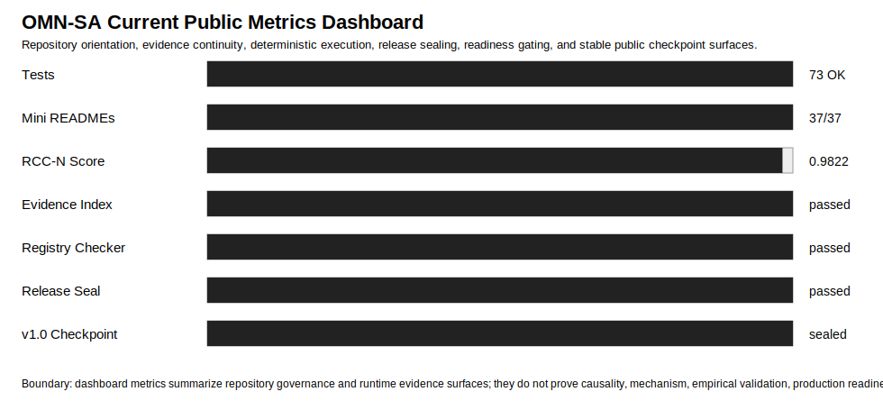

# OMN-SA v0.9.2 Current Public Metrics Dashboard

Generated: 2026-05-19T20:41:33.735971+00:00

## Purpose

This dashboard compresses the current public evidence surface for OMN-SA into one human-readable benchmark page.

It is designed to show what the repository has accomplished without inflating claims beyond the evidence boundary.

## Current Public Metrics

| Surface | Current result | Meaning |
|---|---:|---|
| Unit tests | 63 OK | Local implementation and documentation-health tests pass. |
| Mini README coverage | 37 / 37 | Major repository directories expose local context surfaces. |
| RCC-N effectiveness score | 0.9822222222 | Repository navigation/context coverage score. |
| Regular README baseline | 0.107 | Structural baseline for a normal README-only orientation surface. |
| Measured RCC-N lift | +0.8752222222 | Measured orientation lift over the baseline. |
| Declared artifacts replayed | 12 / 12 | Latest replay target declares artifacts that can be inspected. |
| Missing replay artifacts | 0 | Replay validation found no missing declared artifacts. |
| Metric availability | passed | Required residual metrics are exposed where validators expect them. |
| Deterministic CI fixture | valid | `--ci-mode` fixture validates through explicit output routing. |
| Stable evidence index | passed | Latest evidence can be selected through explicit pointer files. |

## Public Claim

OMN-SA demonstrates that a software repository can expose measurable navigation, evidence, validation, deterministic execution, and claim-boundary surfaces.

## Non-Claims

- This does not prove code correctness.
- This does not prove empirical validation.
- This does not prove causality or mechanism.
- This does not prove biological equivalence or physical manifold identity.
- This does not prove full GMN replication.
- This does not prove AI understanding.
- This does not prove production readiness.

## Chart



## Reproduction Commands

```powershell
python -m unittest discover -s tests
python -m omn run --seed synthetic-toy --ci-mode --run-id omn_ci_smoke --output-dir outputs_ci --no-write-report
python -m omn index-evidence --output-dir outputs_ci
python -m omn report-latest --output-dir outputs_ci --mode ci
python -m omn validate --output-dir outputs_ci --mode ci
python -m omn --help
```

## Boundary

These metrics summarize repository governance and runtime evidence surfaces. They do not prove correctness, empirical validation, causality, mechanism, production readiness, AI understanding, or GMN replication.
